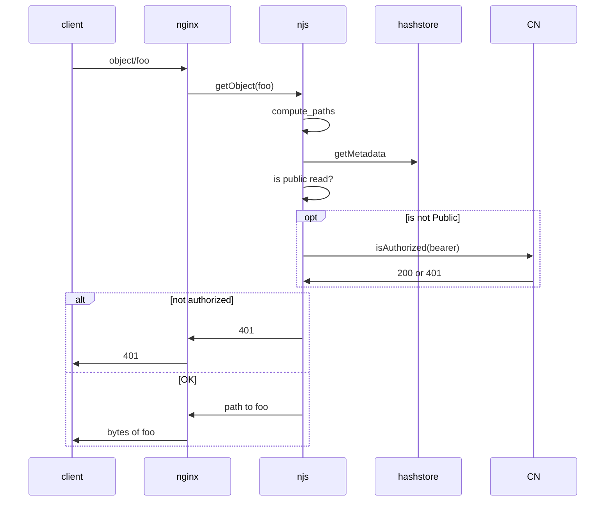

# nginhash

This is an experiment using the Nginx NJS module to create a readonly mechanism for retrieving objects from a hashstore given their PID.

Three main endpoints are provided:
- `/info/<pid>`: Retrieve diagnostic info for `pid`.
- `/meta/<pid>`: Retrieve system metadata for `pid`, including a check for public read permission.
- `/object/<pid>`: Get the object identified by `pid`.


Rough sketch of process for reading an object from hashstore.

## Setup

Checkout then:

```bash
docker compose up
```

## Operation

Three pids are included for some initial testing:

- `urn:uuid:fc6798d4-9e79-4eb7-84d6-db05005cd356` a csv file file system metadata available
- `BLE_LTER_leachate_DOM_composition.csv` a csv file with no system metadata
- `index.parquet` a parquet file for testing byte range requests, no system metadata.


```
curl "http://localhost:2010/info/urn:uuid:fc6798d4-9e79-4eb7-84d6-db05005cd356"
{
  "uri": "/info/urn:uuid:fc6798d4-9e79-4eb7-84d6-db05005cd356",
  "pid": "urn:uuid:fc6798d4-9e79-4eb7-84d6-db05005cd356",
  "pid_path": "/usr/share/nginx/html/hashstore/refs/pids/6c/ea/c0/8b937ade85a34123616a874675d53b4f83967f6ba7637dac9cbc9de376",
  "meta_path": "/usr/share/nginx/html/hashstore/metadata/6c/ea/c0/8b937ade85a34123616a874675d53b4f83967f6ba7637dac9cbc9de376/8b937ade85a34123616a874675d53b4f83967f6ba7637dac9cbc9de376",
  "pid_data": "e68552235dc50dd525f70c52e86d012c2ffbc548845360271e49abbe15a45389",
  "cid_path": "/usr/share/nginx/html/hashstore/refs/cids/e6/85/52/235dc50dd525f70c52e86d012c2ffbc548845360271e49abbe15a45389",
  "cid_data": "urn:uuid:fc6798d4-9e79-4eb7-84d6-db05005cd356\n",
  "cid_object_path": "/hashstore/objects/e6/85/52/235dc50dd525f70c52e86d012c2ffbc548845360271e49abbe15a45389",
  "authorized": {
    "token": "",
    "permission": "read",
    "pid": "urn:uuid:fc6798d4-9e79-4eb7-84d6-db05005cd356",
    "authorized": true,
    "status": 200,
    "message": "Public access",
    "url": null
  }
}
```

```
curl "http://localhost:2010/meta/urn:uuid:fc6798d4-9e79-4eb7-84d6-db05005cd356"
<?xml version="1.0" encoding="UTF-8" standalone="yes"?>
<ns3:systemMetadata xmlns:ns2="http://ns.dataone.org/service/types/v1" xmlns:ns3="http://ns.dataone.org/service/types/v2.0">
    <serialVersion>0</serialVersion>
    <identifier>urn:uuid:fc6798d4-9e79-4eb7-84d6-db05005cd356</identifier>
    <formatId>text/csv</formatId>
    <size>1097</size>
    <checksum algorithm="MD5">89445443fb3af61ba2f5f51b3772695d</checksum>
    <submitter>http://orcid.org/0000-0002-1161-4599</submitter>
    <rightsHolder>http://orcid.org/0000-0002-1161-4599</rightsHolder>
    <accessPolicy>
        <allow>
            <subject>CN=arctic-data-admins,DC=dataone,DC=org</subject>
            <permission>read</permission>
            <permission>write</permission>
            <permission>changePermission</permission>
        </allow>
        <allow>
            <subject>public</subject>
            <permission>read</permission>
        </allow>
    </accessPolicy>
    <replicationPolicy replicationAllowed="false" numberReplicas="0"/>
    <archived>false</archived>
    <dateUploaded>2025-06-17T17:21:49.390+00:00</dateUploaded>
    <dateSysMetadataModified>2025-12-09T18:14:07.504+00:00</dateSysMetadataModified>
    <originMemberNode>urn:node:ARCTIC</originMemberNode>
    <authoritativeMemberNode>urn:node:ARCTIC</authoritativeMemberNode>
    <fileName>Arctic_Soil_Characteristics_Data.csv</fileName>
</ns3:systemMetadata>
```

```
curl "http://localhost:2010/object/urn:uuid:fc6798d4-9e79-4eb7-84d6-db05005cd356"
Core_ID,Latitude,Longitude,Depth_from_surface_cm,Porosity,Soil_Carbon_mmol_g-1,%C,Soil_THg_pmol_g-1
C1A,70.50356,-149.64598,-17.8,70%,15.6,19%,539
C1C,70.50356,-149.64598,-27.3,78%,14.4,17%,324
C2A,70.55561,-149.57750,-24.1,66%,23.3,28%,395
C2B,70.55561,-149.57750,-29.2,55%,14.1,17%,338
C2C,70.55561,-149.57750,-34.3,55%,12.9,15%,291
C2D,70.55561,-149.57750,-39.4,62%,11.9,14%,252
C2E,70.55561,-149.57750,-44.5,56%,11.9,14%,240
C2F,70.55561,-149.57750,-49.5,73%,12,14%,221
C3A,70.55561,-149.57750,-2.2,64%,19,23%,379
C3B,70.55561,-149.57750,-7.0,56%,11.3,14%,168
C3C,70.55561,-149.57750,-12.1,69%,16.5,20%,799
C3D,70.55561,-149.57750,-17.1,66%,14.3,17%,474
C3E,70.50356,-149.64598,-2.5,67%,15.7,19%,328
C3F,70.50356,-149.64598,-10.2,71%,21,25%,287
C4A,71.28784,-156.48659,-350.0,40%,1.5,2%,111
C4C,71.28784,-156.48659,-250.0,13%,2.6,3%,131
C4E,71.28784,-156.48659,-75.0,68%,18.1,22%,234
C5A,71.25907,-156.33628,-55.0,65%,4.9,6%,189
C5C,71.25907,-156.33628,-235.0,90%,4.8,6%,199
C5D,70.87991,-153.89774,-65.0,76%,8.2,10%,257
C5E,70.87991,-153.89774,-65.0,84%,10.2,12%,270
```

Byte range request on CSV file:
```
curl -r 120-200 "http://localhost:2010/object/urn:uuid:fc6798d4-9e79-4eb7-84d6-db05005cd356" 
9.64598,-17.8,70%,15.6,19%,539
C1C,70.50356,-149.64598,-27.3,78%,14.4,17%,324
C
```

Read the parquet using duckdb:

```
$ duckdb -c "select count(*) from read_parquet('http://localhost:2010/object/index.parquet');"
┌──────────────┐
│ count_star() │
│    int64     │
├──────────────┤
│    18081     │
└──────────────┘
```

```
$ time duckdb -c "select * from read_parquet('http://localhost:2010/object/index.parquet') offset 10000 limit 10;"
┌─────────┬────────────┬────────────┬─────────┬─────────────┬─────────┬───┬───────────┬──────────────────────┬───────────┬────────────┬────────────┐
│   pid   │  tcreated  │ tmodified  │    s    │      p      │    o    │ … │ authority │        stype         │   ssize   │   stime    │ properties │
│ varchar │   int32    │   int32    │ varchar │   varchar   │ varchar │   │  varchar  │       varchar        │   float   │   int32    │    json    │
├─────────┼────────────┼────────────┼─────────┼─────────────┼─────────┼───┼───────────┼──────────────────────┼───────────┼────────────┼────────────┤
│ 10000   │ 1765497873 │ 1765497874 │ 10000   │ containedBy │ 9911    │ … │ NULL      │ text/plain           │    1691.0 │ 1761937768 │ NULL       │
│ 10001   │ 1765497873 │ 1765497874 │ 10001   │ containedBy │ 9911    │ … │ NULL      │ text/x-python        │    6491.0 │ 1761937768 │ NULL       │
│ 10002   │ 1765497873 │ 1765497874 │ 10002   │ containedBy │ 9911    │ … │ NULL      │ text/x-python        │   29621.0 │ 1761937768 │ NULL       │
│ 10003   │ 1765497873 │ 1765497874 │ 10003   │ containedBy │ 9911    │ … │ NULL      │ application/octet-…  │ 1252560.0 │ 1761937768 │ NULL       │
│ 10004   │ 1765497873 │ 1765497874 │ 10004   │ containedBy │ 9911    │ … │ NULL      │ text/x-python        │   64529.0 │ 1761937768 │ NULL       │
│ 10005   │ 1765497873 │ 1765497874 │ 10005   │ containedBy │ 9911    │ … │ NULL      │ text/x-python        │     160.0 │ 1761937768 │ NULL       │
│ 10006   │ 1765497873 │ 1765497874 │ 10006   │ containedBy │ 9911    │ … │ NULL      │ DIR                  │      NULL │       NULL │ NULL       │
│ 10007   │ 1765497873 │ 1765497874 │ 10007   │ containedBy │ 9911    │ … │ NULL      │ text/x-python        │   17560.0 │ 1761937768 │ NULL       │
│ 10008   │ 1765497873 │ 1765497874 │ 10008   │ containedBy │ 9912    │ … │ NULL      │ text/x-python        │    4684.0 │ 1761937768 │ NULL       │
│ 10009   │ 1765497873 │ 1765497874 │ 10009   │ containedBy │ 9912    │ … │ NULL      │ text/x-python        │    4740.0 │ 1761937768 │ NULL       │
├─────────┴────────────┴────────────┴─────────┴─────────────┴─────────┴───┴───────────┴──────────────────────┴───────────┴────────────┴────────────┤
│ 10 rows                                                                                                                    12 columns (11 shown) │
└──────────────────────────────────────────────────────────────────────────────────────────────────────────────────────────────────────────────────┘
duckdb -c   0.06s user 0.03s system 91% cpu 0.101 total
```

## Performance

Performance seems reasonable with this small set of test data. Note that the tests were not exercising calling the DataONE `isAuthorized` API.

Run with the following, then navigate to http://localhost:8089/ and set Users to 1000, incrementing 20 per second:

```bash
locust -f locustfile.py
```


